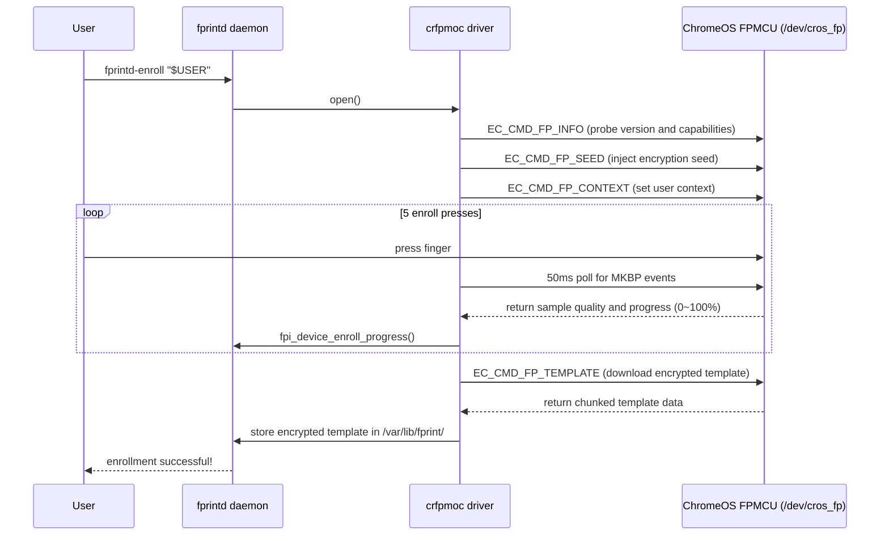

# 🔬 Deep Dive: ChromeOS Match-on-Chip (MoC) Fingerprint Driver Architecture

This article dissects the fingerprint sensor hardware of the **HP Pro c640
Chromebook** (Google `dratini` / `hatch`), the ChromeOS Embedded Controller (EC)
communication protocol, and the implementation principles of the `crfpmoc`
libfprint driver.

---

## 1. Hardware Architecture and Bus Topology

Unlike traditional USB/SPI fingerprint readers, the fingerprint hardware of the
HP Pro c640 uses Google ChromeOS's proprietary **Match-on-Chip (MoC)**
security-isolated architecture:

```text
+-----------------------------------------------------------------------+
|                    Host CPU (Intel Comet Lake-U)                      |
|  - Kernel Driver: cros_ec_spi, cros_ec_chardev                       |
|  - Device Node:   /dev/cros_fp (Character Device, Major 10, Minor ...) |
|  - Userspace:     libfprint (crfpmoc) <-> fprintd <-> PAM             |
+-----------------------------------+-----------------------------------+
                                    | GSPI1 Bus (cros-ec-spi)
                                    | ACPI UID: 1, IRQ: GPP_A23
                                    v
+-----------------------------------------------------------------------+
|                 FPMCU (STM32F4 / Bloonchipper)                        |
|  - Running ChromiumOS EC Firmware                                     |
|  - On-Chip Feature Extraction & Template Matching                     |
|  - Cryptographic Engine (AES-GCM / Seed + Context)                    |
+-----------------------------------+-----------------------------------+
                                    | Dedicated Sensor SPI
                                    v
+-----------------------------------------------------------------------+
|            Fingerprint Cards FPC1025 / FPC1145 Sensor                |
+-----------------------------------------------------------------------+
```

---

## 2. Driver Challenges and Solutions

### Challenge 1: Missing Kernel Interrupt Forwarding (Epoll Starvation)

* **Problem**: On a standard Linux kernel, the FPMCU's ACPI GPIO interrupt
  (`GPP_A23`) is not bound to the `cros_ec_chardev` wait queue. When monitoring
  `/dev/cros_fp` with regular `epoll` or `GPollableInputStream`, events never
  fire.
* **Solution**: Adopt **50ms SSM Delayed Polling** in `crfpmoc`. The state
  machine actively queries the MKBP event mask via ioctl during polling,
  avoiding deadlocks caused by blocked threads.

### Challenge 2: Weak Pointer Lifecycle Guard

* **Problem**: When a user cancels an operation (or a timeout occurs) during
  enrollment or matching, the underlying asynchronous task may still access an
  already-freed device structure, causing a Use-After-Free (UAF) crash.
* **Solution**: Introduce a weak-pointer reference-counting guard that validates
  pointer validity before the asynchronous callback fires.

### Challenge 3: Cryptographic Seed & Context Persistence

* **Problem**: Templates are encrypted by a key derived from two inputs on the
  FPMCU: a **seed** and a **user context (`user_id`)**. Both live in FPMCU
  **RAM, not flash**: the seed (and the `SEED_SET` flag) survive a *warm* reboot
  only because the FPMCU stays powered, and on a *cold* boot they are lost and
  the host re-sends `FP_SEED` from `/var/lib/fprint/crfpmoc.key` (re-sending it
  while already set is rejected with `EC_RES_ACCESS_DENIED`). The user context,
  however, lives in FPMCU **RAM and is reset on every `FP_CONTEXT_ASYNC`**, so it
  **must be re-injected on every open** via `EC_CMD_FP_CONTEXT`. In addition, the
  `FP_CONTEXT` step triggers the FPMCU sensor reset/open (`fp_sensor_open`,
  ~175 ms) that re-initializes the sensor — without it, a freshly rebooted sensor
  cannot decrypt/process templates (`EC_RES_UNAVAILABLE`).
* **Solution**: On first run the driver generates a 32-byte cryptographically
  secure random seed in `/var/lib/fprint/crfpmoc.key` (permissions `0600`) and
  sends `EC_CMD_FP_SEED` only when the FPMCU reports the seed is not yet set
  (`EC_CMD_FP_ENC_STATUS`). On **every** open it sends `EC_CMD_FP_CONTEXT` (even
  when the seed is already set) to re-establish the volatile user context and to
  re-open the sensor after a reboot. The seed file is stable across reboots, so
  enrolled templates generally remain decryptable without re-enrollment.

  > **Note (regression)**: a past driver commit skipped `FP_CONTEXT` whenever the
  > seed was already set, leaving the sensor uninitialized after a reboot
  > (`EC_RES_UNAVAILABLE`) and changing the context bring-up so that templates
  > enrolled under that build became undecryptable — see Troubleshooting §7.

---

## 3. Core State Machine Flow (Enrollment State Machine)


