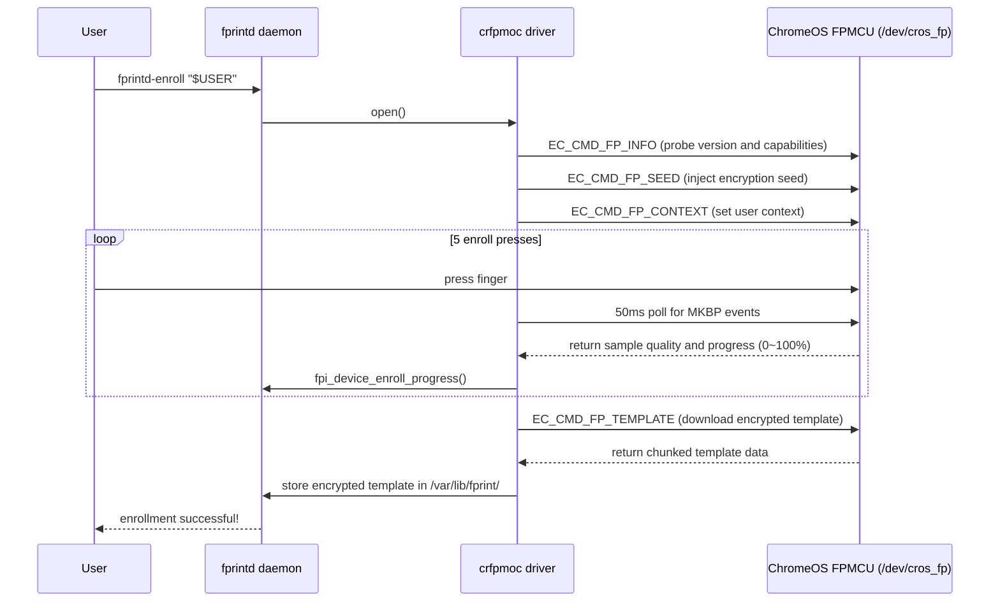

# 🔬 Deep Dive: ChromeOS Match-on-Chip (MoC) Fingerprint Driver Architecture

This article dissects the fingerprint sensor hardware of the **HP Pro c640
Chromebook** (Google `dratini` / `hatch`), the ChromeOS Embedded Controller (EC)
communication protocol, and the implementation principles of the `crfpmoc`
libfprint driver.

---

## 1. Hardware Architecture and Bus Topology

Unlike traditional USB/SPI fingerprint readers, the fingerprint hardware of the
HP Pro c640 uses Google ChromeOS's proprietary **Match-on-Chip (MoC)**
security-isolated architecture:

```text
+-----------------------------------------------------------------------+
|                    Host CPU (Intel Comet Lake-U)                      |
|  - Kernel Driver: cros_ec_spi, cros_ec_chardev                       |
|  - Device Node:   /dev/cros_fp (Character Device, Major 10, Minor ...) |
|  - Userspace:     libfprint (crfpmoc) <-> fprintd <-> PAM             |
+-----------------------------------+-----------------------------------+
                                    | GSPI1 Bus (cros-ec-spi)
                                    | ACPI UID: 1, IRQ: GPP_A23
                                    v
+-----------------------------------------------------------------------+
|                 FPMCU (STM32F4 / Bloonchipper)                        |
|  - Running ChromiumOS EC Firmware                                     |
|  - On-Chip Feature Extraction & Template Matching                     |
|  - Cryptographic Engine (AES-GCM / Seed + Context)                    |
+-----------------------------------+-----------------------------------+
                                    | Dedicated Sensor SPI
                                    v
+-----------------------------------------------------------------------+
|            Fingerprint Cards FPC1025 / FPC1145 Sensor                |
+-----------------------------------------------------------------------+
```

---

## 2. Driver Challenges and Solutions

### Challenge 1: Missing Kernel Interrupt Forwarding (Epoll Starvation)

* **Problem**: On a standard Linux kernel, the FPMCU's ACPI GPIO interrupt
  (`GPP_A23`) is not bound to the `cros_ec_chardev` wait queue. When monitoring
  `/dev/cros_fp` with regular `epoll` or `GPollableInputStream`, events never
  fire.
* **Solution**: Adopt **50ms SSM Delayed Polling** in `crfpmoc`. The state
  machine actively queries the MKBP event mask via ioctl during polling,
  avoiding deadlocks caused by blocked threads.

### Challenge 2: Weak Pointer Lifecycle Guard

* **Problem**: When a user cancels an operation (or a timeout occurs) during
  enrollment or matching, the underlying asynchronous task may still access an
  already-freed device structure, causing a Use-After-Free (UAF) crash.
* **Solution**: Introduce a weak-pointer reference-counting guard that validates
  pointer validity before the asynchronous callback fires.

### Challenge 3: Cryptographic Seed Persistence (TPM Seed & Context Management)

* **Problem**: The FPMCU's RAM templates are cleared after reboot, and each
  device needs an independent key to encrypt/decrypt templates.
* **Solution**: On first run, the driver generates a 32-byte cryptographically
  secure random seed in `/var/lib/fprint/crfpmoc.key` (permissions `0600`), and
  injects the secure seed on every handshake with the FPMCU via `EC_CMD_FP_SEED`
  and `EC_CMD_FP_CONTEXT`.

---

## 3. Core State Machine Flow (Enrollment State Machine)


