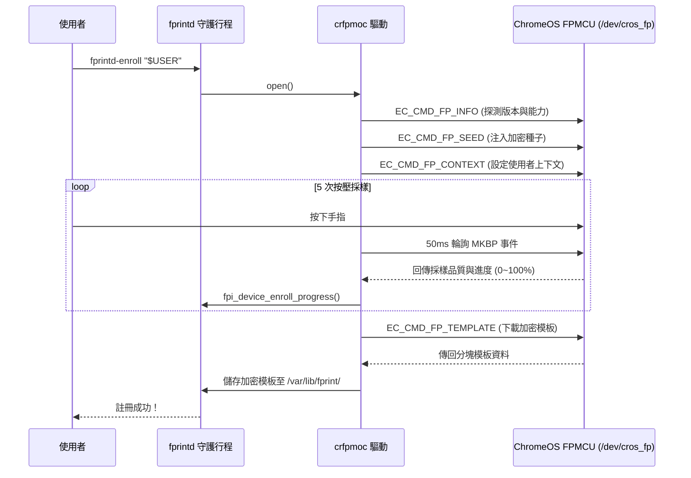

[English](https://github.com/samson1357924/hp-pro-c640-chromebook-linux/blob/main/README.md) | [繁體中文](https://github.com/samson1357924/hp-pro-c640-chromebook-linux/blob/main/README.zh-TW.md)

# 🔬 深度技術解析：ChromeOS Match-on-Chip (MoC) 指紋驅動架構

本文深度解析 **HP Pro c640 Chromebook** (Google `dratini` / `hatch`) 的指紋感測
硬體、ChromeOS Embedded Controller (EC) 通訊協議以及 `crfpmoc` libfprint 驅動
之實作原理。

---

## 1. 硬體架構與匯流排拓撲

HP Pro c640 的指紋硬體不同於傳統 USB/SPI 指紋讀取器，其採用了 Google
ChromeOS 專屬的 **Match-on-Chip (MoC)** 安全隔離架構：

```text
+-----------------------------------------------------------------------+
|                    Host CPU (Intel Comet Lake-U)                      |
|  - Kernel Driver: cros_ec_spi, cros_ec_chardev                       |
|  - Device Node:   /dev/cros_fp (Character Device, Major 10, Minor ...) |
|  - Userspace:     libfprint (crfpmoc) <-> fprintd <-> PAM             |
+-----------------------------------+-----------------------------------+
                                    | GSPI1 Bus (cros-ec-spi)
                                    | ACPI UID: 1, IRQ: GPP_A23
                                    v
+-----------------------------------------------------------------------+
|                 FPMCU (STM32F4 / Bloonchipper)                        |
|  - Running ChromiumOS EC Firmware                                     |
|  - On-Chip Feature Extraction & Template Matching                     |
|  - Cryptographic Engine (AES-GCM / Seed + Context)                    |
+-----------------------------------+-----------------------------------+
                                    | Dedicated Sensor SPI
                                    v
+-----------------------------------------------------------------------+
|            Fingerprint Cards FPC1025 / FPC1145 Sensor                |
+-----------------------------------------------------------------------+
```

---

## 2. 驅動面臨之挑戰與解決方案

### 挑戰 1：Linux 核心中斷轉發缺失 (Epoll Starvation)

* **問題**：在標準 Linux 核心中，FPMCU 的 ACPI GPIO 中斷（`GPP_A23`）並未與
  `cros_ec_chardev` 的等待佇列綁定。使用常規的 `epoll` 或
  `GPollableInputStream` 監聽 `/dev/cros_fp` 時，事件永遠不會觸發。
* **解決方案**：在 `crfpmoc` 中採用 **50ms SSM 延遲狀態機輪詢（50ms SSM
  Delayed Polling）**。狀態機在輪詢期間主動透過 ioctl 查詢 MKBP 事件遮罩，避免
  行程死鎖阻塞。

### 挑戰 2：記憶體弱指標守護 (Weak Pointer Lifecycle Guard)

* **問題**：當使用者在註冊或比對過程中取消操作（或發生 Timeout），若底層非同步
  任務尚未結束，可能會存取已被釋放的裝置結構，造成 Use-After-Free (UAF) 崩潰。
* **解決方案**：引入 weak-pointer 參照計數守護，在非同步 callback 觸發時先行校驗
  指標有效性。

### 挑戰 3：加密種子與 Context 的持久化

* **問題**：模板由 FPMCU 上的金鑰加解密，而該金鑰由兩個輸入衍生：**seed** 與
  **user context (`user_id`)**。兩者都在 FPMCU 的 **RAM（不是 flash）**：seed（與
  `SEED_SET` 旗標）只在*暖*重開機（FPMCU 持續供電）時保留，*冷*重開機會遺失、由主機從
  `/var/lib/fprint/crfpmoc.key` 重新送 `FP_SEED`（已設時重送會被 `EC_RES_ACCESS_DENIED` 拒絕）。
  但 **user context 在 FPMCU RAM，且每次 `FP_CONTEXT_ASYNC` 都會被重置**，所以**每次 open 都必須
  重新透過 `EC_CMD_FP_CONTEXT` 注入**。此外，`FP_CONTEXT` 步驟會觸發 FPMCU 感應器的
  reset/open（`fp_sensor_open`，約 175 ms）把感應器重新初始化——若缺少此步，重開機後
  的感應器無法解/處理模板（`EC_RES_UNAVAILABLE`）。
* **解決方案**：驅動首次運行時在 `/var/lib/fprint/crfpmoc.key` 產生 32-byte 密碼學安全隨機
  種子（權限 `0600`），並**只**在 FPMCU 回報 seed 尚未設定時（`EC_CMD_FP_ENC_STATUS`）
  才送 `EC_CMD_FP_SEED`。但**每次** open 都會送 `EC_CMD_FP_CONTEXT`（即使 seed 已設），
  用來重建易失的 user context，並在重開機後重新開啟感應器。seed 檔跨重開機穩定不變，
  因此已註冊模板通常無需重新註冊即可解密。

  > **註（回歸問題）**：曾有 driver commit 在 seed 已設時跳過 `FP_CONTEXT`，導致重開機後
  > 感應器未初始化（`EC_RES_UNAVAILABLE`），且改變了 context 帶起流程，使該版本下註冊的
  > 模板無法解密——詳見 Troubleshooting §7。

---

## 3. 核心狀態機流程 (Enrollment State Machine)


